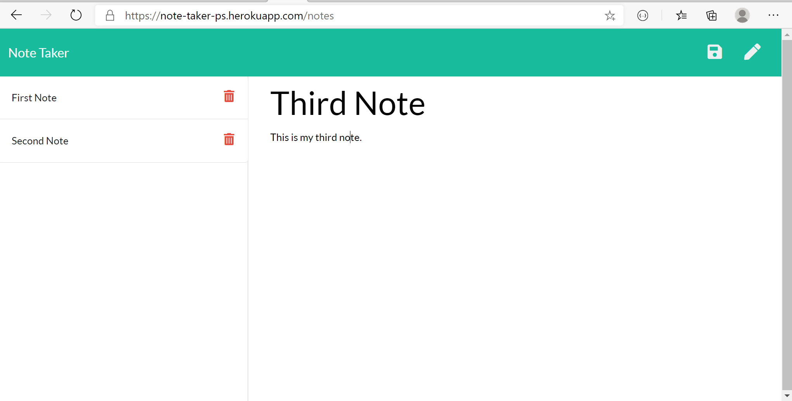

# Note Taker

## Description

This application allows users to write, save and delete notes.

## Table of Contents

[Usage](#usage)  
[License](#licenses)  
[Contributing](#contributing)  
[Deployment](#deployment)  
[Visuals](#visuals)  
[Questions](#questions)

## Usage

Allows users to keep track of information so that it is available to them when needed.

## Licenses

The underlying source code used to format and display this content is licensed under the 

## Contributing

Trilogy Education Services (Frontend)
Prabh Singh (Backend)

## Deployment

<a href="https://note-taker-ps.herokuapp.com/">Note Taker Deployment (click to open)</a>

## Visuals

## Questions

My Github profile is <a href="https://github.com/prabhm512">prabhm512</a>.

If you have any questions regarding this project, please email prabhm512@gmail.com.
